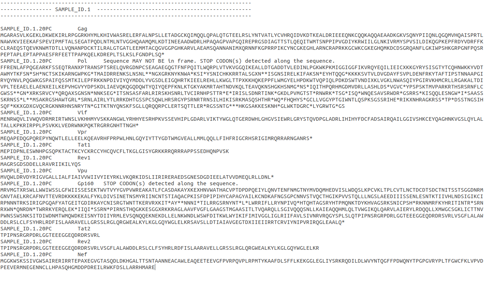

## INITIO DATA PROCESSING


This command-line interface (CLI) has been developed to perform some of the processes needed for the INITIO project, which aims to study the prevalence of resistance to inhibitor of Integrase among treatment-naive individuals with recent HIV infection in England. 

### **REQUIREMENT**

The method uses the following packages and Python libraries:

- Python 3.6.13
- Biopython 1.78
- Pandas 1.1.5
- Openpyxl 3.0.9
- mafft 7.310

The complete list of software is summaried in the file called initio_environment.yml, see below. 

One of these distibutions ([Anaconda](https://www.anaconda.com/products/individual) or [Miniconda](https://docs.conda.io/en/latest/miniconda.html)) must be used for installing and managing all the software packages and other additional dependencies in a linux computer. For *Windows users*, **mafft** should be installed manually from https://mafft.cbrc.jp/alignment/software/windows.html. 

[Git](https://git-scm.com/) is used to download the repository into the subdirectory **"Antiviral Unit/Project - INITiO"** by typing in a terminal:

`git clone https://github.com/juanledesma78/initio_data_processing.git`

, which will create a new directory with the files:

- [**hiv_initio_project.py**](hiv_initio_project.py)
- [**initio_environment.yml**](initio_environment.yml),
- [**K03455.1_HXB2.fasta**](K03455.1_HXB2.fasta)

To install all the dependecies in an environement called **initio** using the *YML* file, enter in a terminal 

`
conda env create -f path/to/initio_environment.yml -p /home/phe.gov.uk/another.user/miniconda3/envs/initio
`

being the value after the argument -p the *location where conda is installed* followed by *envs/initio*.

Other dependencies that the CLI needs are:

- access to the **PHE High Performance Computing (HPC) cluster**,
- installation of the bioiformatics pipeline [**Genomancer**](https://github.com/davidfbibby/genomancer_scripts) for HIV,
- PHE tool **QuasiBAM**,
- **Jumping profile Hidden Markov Model (jpHMM)**, [locally installed](http://jphmm.gobics.de/download.html).

### **USAGE**

The script **hiv_initio_project.py** manages all the tools the method offers. The **conda environment initio** must be activated to use the CLI by typing in the terminal 

`conda activate initio`

The usage of the script is as followed: 

`python3 /path/to/hiv_initio_project.py --input [-pgen] [-qc] [-c] [-fg] [-j] [-pjp] [-dc] [-md30c]`

with **--input**, which is ***required*** for all the tools to work, being the path to the directory to analyse, except for the argument **-j**, that it takes a *FASTA* file,  

followed by the *optional arguments* (**-pgen**, **-qc**, **-c**, **-fg**, **-j**, **-pjp**, **-dc** or **-md30c**) that invoke a specific tool, entered one a time. 

Details about the function of each tool can be found by typing:

`python3 hiv_initio_project.py --help`

but also in the following section.

### **TOOLS**

<br />

#### **-PGEN ,--POST_GENOMANCER**

HIV samples are sequenced by Illumima platform using a next generation (NGS) protocol of target-enrichment by sequence capture. The data is firstly processed using the pipeline **Genomancer** in the HPC, which generates the following outputs:

* *HIV_read_count.tsv*, summary of the input/output of the reads processed by pipeline for each step. 

* *HIV_typonomers.zip*, compressed file with a collection of *CSV* files for each sequence generated, containing the number of reads matching a specific HIV reference sequence and its frequency. The reads used for this process are the ones obtained after using several filters (trimmomatic, dehumanised reads, etc) and can offer an idea of the classification or subtyping of the samples. However, usual tools for the subtyping of HIV are used to confirm the subtype of the viruses. 

* *HIV_quasibams.zip*, compressed file with *TABULAR* files generated by **QuasiBAM** tool. Each file consists of the results of the mapping of the reads to a particular reference sequence, giving information about the nucelotides at every single position with the frequency for the nucleotides and the one for the amino acids for each codon. This file is used to generate a consensus sequence at a particular frequency of nucleotides at each position. 

* *HIV_genomes.fas*, nucleotide sequences in *FASTA* format generated by QuasiBAM at a minimun base frequency of 15% to call a nucleotide in the consensus and a minimum depth of 30 reads for calling a position. 

* **HIV_post-run.zip**, compressed file with *NEX* files to check the phylogeny of the sequences generated by Genomancer. 

With argument ***-pgen, --post_genomancer*** selected, the method 

- decompresses the files *"_quasibams.zip"*,*"_post-run.zip"* and *"_typonomer.zip"* into new subdirectories *quasibams*, *post-run* and *typonomer*, respectively. 

- processes the files *.tabular* stored in *quasibams* to generate a file *Coverage_Depth_Summary_HIV.csv*, which contains the coverage depth for all the sequences. 

- invokes the **QuasiBAM tool** in the HPC cluster and re-analises the files *.tabular* to generate files *.fas*, containing sequences of Majority and Minority variants(at frequency of 20 and 2%, respectively) at depth of 100 reads. If needed, it also creates an additional FASTA file at frequency of 20% but depth of 30 reads by using the value "*mad30*" *-p/--post_genomancer*.

- accesses the data from the files *.nex* from directory *post-run*,  *_read_counts.tsv* and *_genomes.fas* and creates a file *Summary_Genomancer_Results_HIV.csv*, with information about the number of contigs identified by genomancer, sequencing metrics (Median Depth, sequence length...) and whether or not the sequences are included in the phylogenetic trees *.nex*.

- extracts each sequence from the file *_genomes.fas* and creates an single file *.fas* per sequence into a new directory called *FASTAs*. 


All the files and folders labelled as "^" in the Figure 1 **must** be transferred then to the specific Run folder in the *Project - INITiO*. 

<br />

#### **-QC, --QUALITY_CONTROL**

The method called by the argument ***-qc, --quality_control*** 

- takes each *.tabular* file from the directory *quasibams* and generate a new file *_Quasibam_FASTA_numbering.xlsx* for each sequence. This file contains the same information as the *tabular* files but an extra column refering the positions at the 20PC FASTA sequence. As the inclusion of insertions and deletions depends of the Depth choosen to create the consensus sequence, the positions in this new column are aproximation to the real ones.

- aligns the files *.fas* for each sample to the reference sequence [**K03455.1_HXB2.fasta**](K03455.1_HXB2.fasta) and saves the resulting alignmets in a recently created subdirectory *quasibams/tmps*. Each alignment is then **trimmed** to create *sub-alignments* for each gene, using the coordinates of the reference sequence for each domain (Gag, Polymerase, Vif, Vpr, Tat1 and Tat2,Rev1 and Rev2, Vpu, Gp160 and Nef) to perform the trimming. The sequences for each trimmed *sub-alignment* are analysed for **potential frame-shifts** using the following algorithm:
   * The trimmed reference sequence for each gene should be in frame after removing any gap and traslation to amino acids. Each query sequence is evaluated for **three different frames**. Each one of them are translated to amino acids after removing any gaps and aligned to the trimmed amino acid reference sequence again. The frame alignments are scored for similarities and only if the first one gets the higher score, the sequence is considered to be potentially in frame. In a subsequent step, an evaluation for the **presence of stop codons** along the query sequences is carried out by detection of the symbol "*" in any position of the sequence except for the last one. 

  Information about potential frame shifts or stop codons in the sequences are recorded in the file *FRAMESHIFT_initial_check_RUNID.txt* in *quasibams* (see example in Figure 2). 
  
  After doing the evaluation, the method generates a file *_aligned_to_HXB2.fas* per sample, containing the sequences aligned to the gene segments of reference, and saved them in a subdirectory *quasibams/data_to_clean*.

The *FASTA* files in combination with file *_Quasibam_FASTA_numbering.xlsx* and the report *FRAMESHIFT_initial_check_RUNID.txt* can be used to evaluate the quality of the sequences and carry out any manually modification needed. 

Mafft is used (through Biopython) to align the sequences and a warning can be return by Biopython while perfoming the alignments

```
BiopythonWarning: Partial codon, len(sequence) not a multiple of three. Explicitly trim the sequence or add trailing N before translation. This may become an error in future.
  BiopythonWarning,
```

This is due to indels in the query nucleotide sequences that distrub the translation to amino acid sequences. Mafft aligns the sequences to a reference sequence and translate to amino acids. The codons with indels (nucleotides and gaps "-") contribute to this warning. Trimming those partial codons or introducing N would modify the raw sequence and it would be more difficult to analyse the quality of the sequence. 


<br />

#### **-C, --CONFIRMATION**

The argument **-c, --confirmation** works similar to the one above but in this case, the method takes the *FASTA* files from the subdirectory *quasibams/data_to_clean*, which quality has been checked and the sequences modified if needed. In this step a file *FRAMESHIFT_post_cleaning_RUNID.txt* is generated to check that any potential manual edition in the sequences is correct.  


<br />


#### **-FG ,--FILE_GENERATION**

With **-f, --file_generation** selected, the method

- takes the confirmed and clean *FASTA* files from the subdirectory *quasibams/data_to_clean* and creates the files *_2-20PC_D100_seqs_for_Resistance_report.fasta* and *_20PC_D100_seqs_for_WG_Subtyping.fasta* in a new directory called *fastas*. An additional file *_20PC_D30_seqs_for_All_Analyses.fasta* may be created if majoritiy variants at depth of 30 reads have been analysed. 

- creates new directories *hivdb.stanford.report* and *subtyping* to store the reports of the subtyping and resistance analyses. 

- generates a file *_2-20PC_HIV_Genome_map.fasta*, for numbering and genomic mapping purposes, containing the query sequences aligned to all the gene segments of reference.


The file *_2-20PC_D100_seqs_for_Resistance_report.fasta* (or *_20PC_D30_seqs_for_All_Analyses.fasta*) is used for **HIV antiviral resistance genotyping** using:

  * ["HIVdb Program: Sequence Analysis" from the Stanford University HIV Drug Resistance Database](https://hivdb.stanford.edu/hivdb/by-sequences/).

The file *_20PC_D100_seqs_for_WG_Subtyping.fasta* (or *_20PC_D30_seqs_for_All_Analyses.fasta*) is used for the **HIV subtyping** using the tools:
    * [COntext-based Modeling for Expeditious Typing (**COMET**)](https://comet.lih.lu/)
    * [**REGA** HIV subtyping tool**](https://www.genomedetective.com/app/typingtool/hiv)
    * **jpHMM**


<br />


####  **-J, --JPHMM**

While the other tools described above take a folder as a value for the argument *--input*, this one takes **FASTA files** to perform the analysis. 

The software **jpHMM** must be [locally installed](http://jphmm.gobics.de/download.html) before running the script and the FASTA files to analyse (*_20PC_D100_seqs_for_WG_Subtyping.fasta* or *_20PC_D30_seqs_for_All_Analyses*, see previous step) should be stored in the subdirectory *jphmm/fastas*.

With the argument **-j, --jphmm**selected, the method 

- takes the FASTA files from *jphmm/fastas*, invokes jpHMM to analyse the sequences and saves the results in a new folder with the same name as the FASTA file in de subdirectory *jphmm/outputs*. The results obtained from the subtyping by jpHMM consist of:
  - *alignment_to_msa.txt*
  - *posterior_probabilities_for_seq_X.txt*
  - *posterior_recombination_path.txt*
  - *query_to_ref_alignments.txt*
  - *recombination_incl_gaps.txt*
  - *recombination.txt*
  - *recombination_without_positions.txt*
  - *variable_regions.txt*
  - *viterbi_path.gff*

When the process is finished, it is recommended to check whether all the sequences contained in the FASTA file have been analysed (displayed in the terminal with the message `Analysing sequences Sequence ID` for each sequence) by comparing with the results included in the file *recombination_without_positions.txt*. 

Jphmm can ocassionally stop becuase the subtyping is a very memory demanding process or due to the high N contain present in a sequence, as jpHMM can not predict a subtype. If this happens or any sequence is missing, it is recommended to create a new FASTA file with the remaining sequences to analyse, and rename the file by adding PXX to the end of the original file name (i.e._20PC_D100_seqs_for_WG_Subtyping_*P01*.fasta).  

<br />


#### **-PJP, --POST_JPHMM**

Apart form the required argument *--input*, this tool takes an argument **-pjp, --post_jphmm** which value is the directory where the subtyping results for the run have been saved. If several directories have been created to analyse different FASTA files, the value to take should be the common name between those directories (i.e *_20PC_D100_seqs_for_WG_Subtyping_* for file ending in P01 or P02...). With the path to the jphmm report(s), the method

-  takes the information from report *recombination_without_positions.txt* and creates the file *results_NGS_Run_jpHMM.csv* with the subtyping of the sequences after using the tool jpHMM.
- takes the file *recombination.txt* and generates a file *Recombination_positions_NGS_Run_jpHMM.txt*, which contains the positions used to assay the subtype clasification, very useful to predict the breakpointc in a recombination. 


<br />


#### **-DC, --DATA_CONSOLIDATION**

With **-dc, --data_consolidation** selected, this tool, which works for those sequences generated at depth of **100 reads** and frequency of 20% and 2% (**majority** and **minority** *variants, respectively)

- decompresses the file *.zip* with the Stanford report from *hivdb.stanford.report*,
- consolidates the data from
  - *RUNID_sample_list.csv* and *RUNID_NGS_QC.csv*, both provided by the user (see Figure 1), 
  - *Summary_Genomancer_Results_HIV.csv*,
  - the subtyping reports generated by COMET (*subtyping/comet*), REGA (*subtyping/rega*) and jpHMM (*subtyping/jphmm*) and 
  - the *Stanford report*

  and creates a file *_NGS_Results_2-20PC_D100.xlsx* in the main directory of the INITIO batch, with the information for all the runs analysed in the same batch. 


<br />


#### **-MD30C,--MAJORITY_30**
The argument **-md30c,--majority_30** works similar to the previous one but is specific for those sequences generated at depth of **30 reads** and frequency of 20% (**majority**).

<br />


<b> 

**Figure 1**. Structure of the INITIO project directory. An initial batch (i.e. INITIO2019-2020) contains as many NGS runs as needed to process all the samples of the batch. The NGS run has several subdirectories created by any of the tools (#) and some, which are temporay, are removed when they are not needed any more (+). The symbol ^ indicates the folders and files than need to be transferred from the CLuster to the final destination. At the moment, the user needs to provide some files for some of the tools to carry out therir functions. The tools corresponding to the arguments are displayed on the right side pointing the element of the directory they work on.
</b>
```
.
└── INITIO_Project
    ├── Batch
    │   ├── INITIO_Batch_NGS_Results_2-20PC_D100.xlsx                       	<--- DATA_CONSOLIDATION
    │   └── NGS_Run
    │       ├── NGS_Run_NGS_QC.csv                         	<~~~~~~~~~~~~~~~~~~~ Provided by User
    │       ├── NGS_Run_sample_list.csv		                <~~~~~~~~~~~~~~~~~~~ Provided by User
    │       ├── Summary_Genomancer_Results_HIV.csv	(^)		        <--- POST_GENOMANCER
    │       ├── Coverage_Depth_Summary_HIV.csv (^)				<--- POST_GENOMANCER
    │       ├── typonomer (# ^)						        <--- POST_GENOMANCER
    │       │   └── 1000XX_Sample_ID.subtype.csv
    │       ├── HIV_genomes.fas
    │       ├── post-run (# ^)					                <--- POST_GENOMANCER
    │       │   ├── env.nex
    │       │   ├── gag.nex
    │       │   ├── nef.nex
    │       │   ├── pol.nex
    │       │   ├── vif.nex
    │       │   └── vpu.nex
    │       ├── quasibams (# ^)					                <--- POST_GENOMANCER
    │       │   ├── Sample_ID.1.20PC.fas				        <--- POST_GENOMANCER
    │       │   ├── Sample_ID.1.2PC.fas					        <--- POST_GENOMANCER
    │       │   ├── Sample_ID.1.tabular					        <--- POST_GENOMANCER
    │       │   ├── data_to_clean (+)					        <--- QUALITY_CONTROL
    │       │   │   └── Sample_ID.1_all_genes_aligned.fas                   	<--- QUALITY_CONTROL
    │       │   ├── FRAMESHIFT_initial_check_NGS_Run.txt                    	<--- QUALITY_CONTROL
    │       │   ├── Sample_ID.1_Quasibam_FASTA_numbering.xlsx               	<--- QUALITY_CONTROL
    │       │   ├── tmps (+)						        <--- QUALITY_CONTROL
    │       │   │   ├── Sample_ID.1_20-2PC_HXB2.fas			        <--- QUALITY_CONTROL
    │       │   │   └── Sample_ID.1_aligned_to_HXB2.fas			        <--- QUALITY_CONTROL 
    │       │   ├── FRAMESHIFT_post_cleaning_NGS_Run.txt		        <--- CONFIRMATION
    │       │   └── Sample_ID.1_2-20PC_HIV_Genome_map.fasta		        <--- FILE_GENERATION
    │       ├── hivdb.stanford.report (#)				        <--- FILE_GENERATION
    │       │   ├── NGS_Run.zi					<~~~~~~~~~~~~~~~~~~~ Provided by User
    │       │   └── NGS_Run							<--- DATA
    │       │       ├── MutationList_Sample_ID.1.20PC.csv
    │       │       ├── PrettyAA_IN.csv
    │       │       ├── PrettyAA_PR.csv
    │       │       ├── PrettyAA_RT.csv
    │       │       ├── Raw_Sample_ID.1.2PC.json
    │       │       ├── resistanceSummaries.csv
    │       │       ├── sequenceSummaries.csv
    │       │       └── unsequencedRegions.csv
    │       ├── fastas (#)						    	<--- FILE_GENERATION
    │       │   ├── NGS_Run_20PC_D100_seqs_for_WG_Subtyping.fasta	    	<--- FILE_GENERATION
    │       │   └── NGS_Run_2-20PC_D100_seqs_for_Resistance_report.fasta	<--- FILE_GENERATION
    │       ├── subtyping (#) 						    	<--- FILE_GENERATION
    │       │   ├── comet (#)
    │       │   │   └── results_NGS_Run.csv 		   	<~~~~~~~~~~~~~~~~~~~ Provided by User
    │       │   ├── jphmm (#)
    │       │   │   ├── Recombination_positions_NGS_Run_jpHMM.txt		<--- POST_JPHMM
    │       │   │   └── results_NGS_Run_jpHMM.csv				<--- POST_JPHMM
    │       │   ├── rega (#)
    │       │   │   └── results_NGS_Run.csv 		        <~~~~~~~~~~~~~~~~~~~ Provided by User
    │       │   └── rip
    │       ├── hivdb.stanford.report (#)				        <--- FILE_GENERATION
    │       │   ├── NGS_Run.zip				       	<~~~~~~~~~~~~~~~~~~~ Provided by User
    │       │   └── NGS_Run						        <--- DATA_CONSOLIDATION
    │       │       ├── MutationList_Sample_ID.1.20PC.csv
    │       │       ├── PrettyAA_IN.csv
    │       │       ├── PrettyAA_PR.csv
    │       │       ├── PrettyAA_RT.csv
    │       │       ├── Raw_Sample_ID.1.2PC.json
    │       │       ├── resistanceSummaries.csv
    │       │       ├── sequenceSummaries.csv
    │       │       └── unsequencedRegions.csv
    │       └── NGS_Run_Sequencing_results.csv					<--- DATA_CONSOLIDATION
    └── initio_data_processing
        ├── hiv_initio_project.py
        ├── initio_environment.yml
        └── K03455.1_HXB2.fasta
```


<b>

**Figure 2**. Example of report generated after using the tool invoke with argument -qc/--quality_control for checking potential frame shifts due to insertions or deletions and the presence of stop codons in the sequences. The tool was developed as an alternative to [HIV Sequence Locator](https://www.hiv.lanl.gov/content/sequence/LOCATE/locate.html)

</b>


## **CONTACT DETAILS**

Juan Ledesma

UK Health Security Agency

juan.ledesma@ukhsa.gov.uk 

August 2022